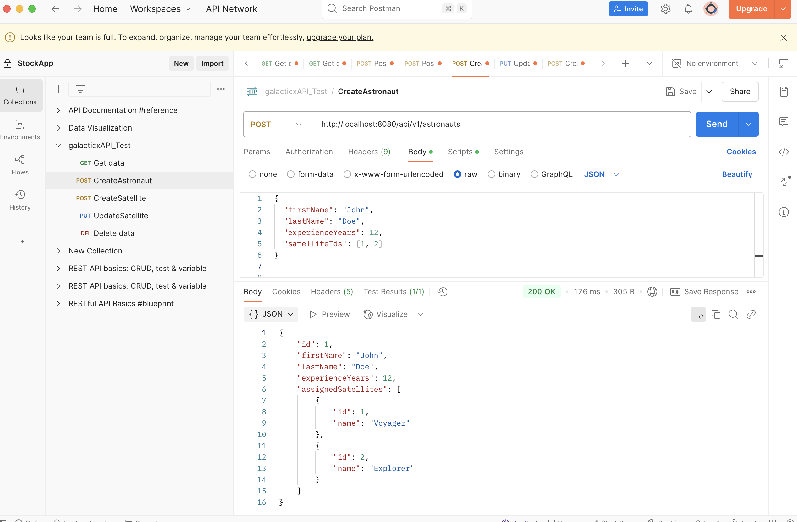
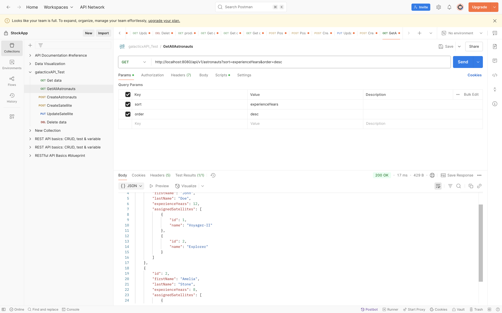
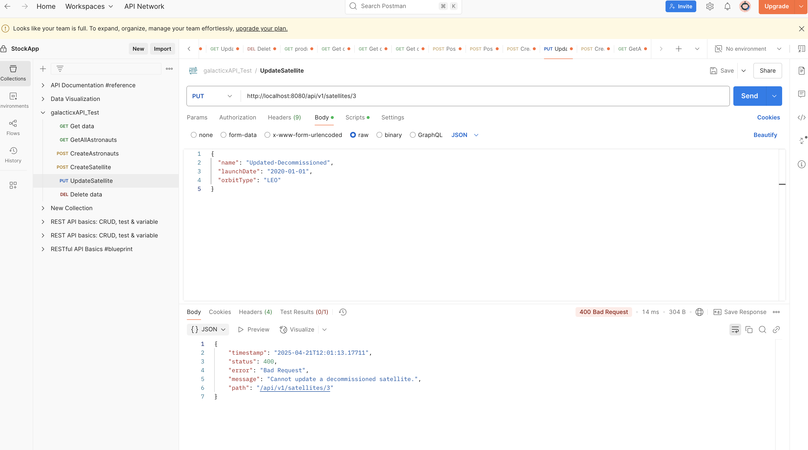
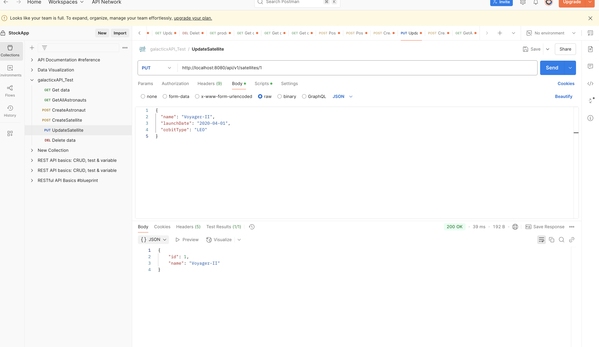
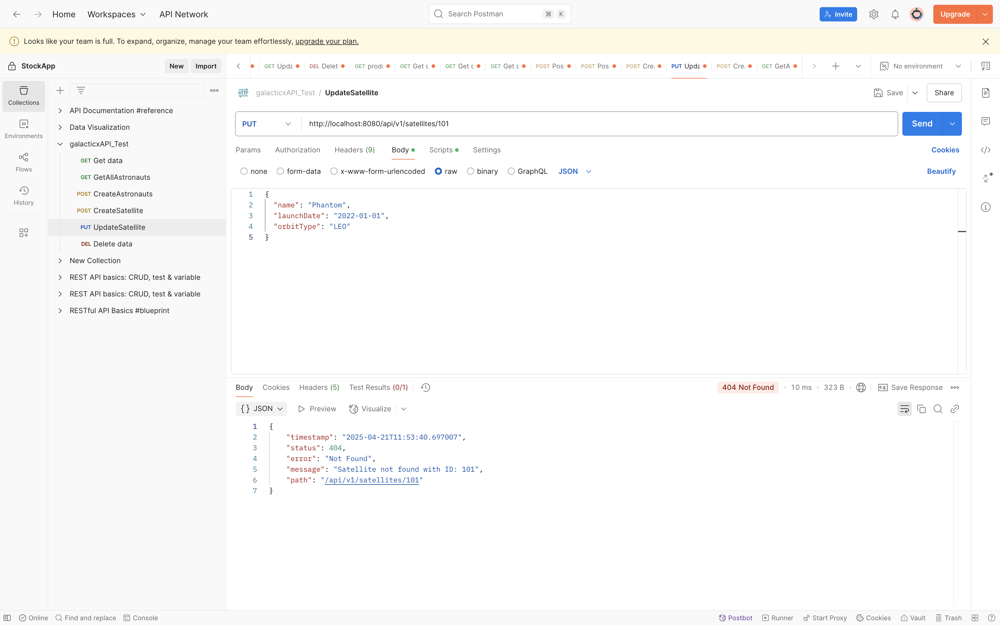

A layered Spring Boot REST API for managing astronauts and satellites. Supports creating astronauts with assigned satellites, updating satellites (unless decommissioned), and fetching astronaut data with clean DTOs, validation, and global exception handling.

🔹 Many-to-Many JPA relationship
🔹 Bean validation and error formatting
🔹 Clean architecture (Controller → Service → Repository)
🔹 H2 database with sample data
🔹 Tested via Postman

## 📸 Screenshots

### 1. Create Astronaut (Postman)

### 2. Get All Astronauts (Sorted)

### 3. Error - Decommissioned Satellite Update

### 4. Update Satellite

### 5. Exception for updateing un existing satellite

